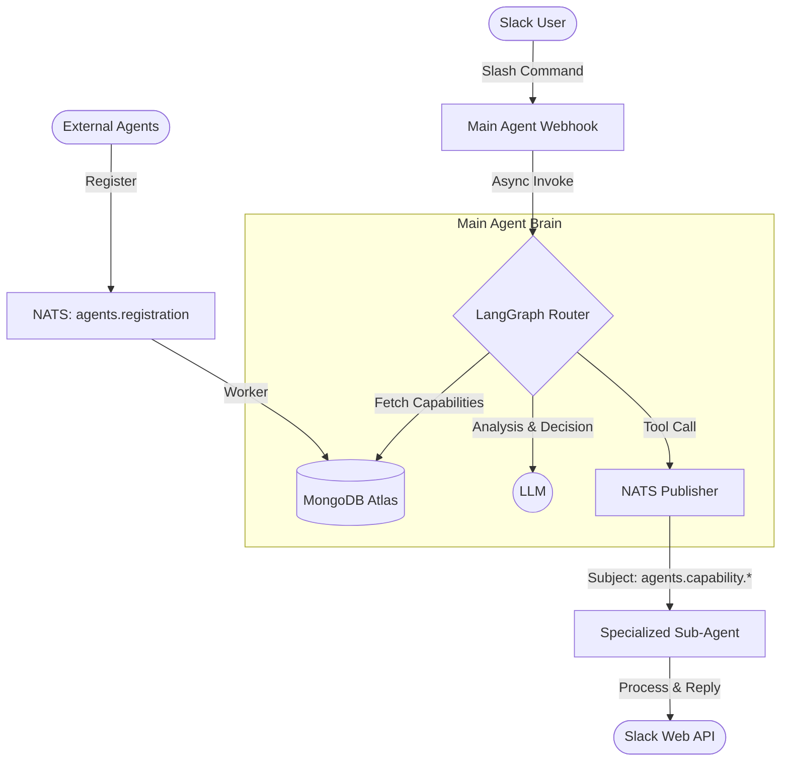

# Agent Workshop: Smart Routing Gateway

A high-performance, modular Agent system built with **Node.js**, **TypeScript**, and **LangGraph**. This project implements a central "Main Agent" that acts as an intelligent gateway, routing user requests from Slack to various specialized sub-agents via **NATS** based on capabilities registered in **MongoDB Atlas**.

Designed for **Vibe Coding** and AI-agent collaboration, this repository follows a clean Monorepo structure that is easily extensible by both humans and LLMs.

---

## 🏗 Architecture & System Flow



1.  **Capability Registration**: External agents register their abilities (name, description, NATS subject suffix) by publishing to a NATS registration subject. A background worker in the Main Agent persists this to MongoDB.
2.  **Intelligent Routing**: When a Slack request arrives, the Main Agent dynamically injects all registered capabilities into the LLM's context.
3.  **Dispatching**: If a match is found, the agent uses the `publish_to_nats` tool to forward the request + Slack context (channel, user, thread_ts) to the dedicated NATS subject.
4.  **Direct Response**: If no capability matches, the Main Agent engages in a direct conversation with the user as a fallback.

---

## 📦 Project Structure

This is a Monorepo managed via npm workspaces:

-   **`apps/main-agent/`**: The central routing service.
    -   `src/agent/`: Core LangGraph logic, tools, and state definitions.
    -   `src/api/`: Slack Webhook handlers.
    -   `src/workers/`: Background NATS listeners for agent registration.
-   **`packages/common/`**: Shared library for all agents in the ecosystem.
    -   `services/`: Production-ready wrappers for NATS, MongoDB, and Slack.
    -   `models/`: Unified TypeScript interfaces and NATS message schemas.
-   **`k8s/`**: Kubernetes manifests for production deployment.
-   **`.github/workflows/`**: CI/CD pipeline for AWS ECR deployment.

---

## 🛠 Shared Package (@agent-workshop/common)

The `common` package is designed to be the foundation for any new agent added to this workshop:

-   **`NatsService`**: Handles connection (with auth support), JSON encoding/decoding, and async subscription.
-   **`SlackService`**: Specialized in threaded replies. It automatically handles `thread_ts` logic to ensure conversations stay organized in Slack.
-   **`MongoService`**: Type-safe MongoDB client for capability management.
-   **`AGENT_SUBJECT_PREFIX`**: Enforces a global naming convention (`agents.capability.*`) for all inter-agent communication.

---

## 🚀 Getting Started

### 1. Prerequisites
- Node.js 20+
- NATS Server (with authentication)
- MongoDB Atlas cluster
- OpenAI API Key
- Slack App with Slash Command and `chat:write` permissions

### 2. Configuration
Copy the template and fill in your credentials:
```bash
cp apps/main-agent/config.toml.template apps/main-agent/config.toml
```

### 3. Installation & Development
```bash
# Install all dependencies
npm install

# Build the common package
npm run build -w @agent-workshop/common

# Start main agent in dev mode
cd apps/main-agent
npm run dev
```

### 4. Testing
- `npm run test:reg`: Simulate an external agent registering its capability.
- `npx ts-node test-agent.ts`: Verify the LLM routing and NATS dispatching logic.
- `npx ts-node test-slack.ts`: Test Slack message and thread delivery.

---

## 🤖 Vibe Coding & AI Collaboration

This repo is **Agent-Friendly**:
- **Type Safety**: Full TypeScript coverage across the Monorepo ensures LLMs can navigate and refactor code with confidence.
- **Modularity**: New tools or agents can be added by simply implementing the `IAgentCapability` interface.
- **Standardized Communication**: All agents communicate via the `NatsRequestMessage` schema defined in `common`.

---

## 🚢 Deployment

### Docker
```bash
docker build -t main-agent .
```

### GitHub Actions & AWS
1. Configure OIDC between GitHub and AWS.
2. Set your `AWS_ROLE_ARN`, `AWS_REGION`, and `ECR_REPOSITORY` in `.github/workflows/deploy.yml`.
3. Push to `main` branch to trigger the build and push.

### Kubernetes
Apply manifests from the `k8s/` directory. Ensure `configmap.yaml` is updated with production secrets.
